  <a href="https://raw.githubusercontent.com/marcreichel/marcreichel/main/github-achievements.svg"><strong>🏆 Full list of achievements</strong></a>

 

 

<h3 align="center">
  MY TECH STACK
</h3>

  
  
  
  
  
  
  
  
  
  
  
  
  
  
  

 

<h3 align="center">
  MY TOOLS
</h3>

  
  
  
  
  
  
  
  
  
  
  
  
  
  
  
  
  
  
  

 

<h3 align="center">
  STATISTICS
</h3>

  

[website]: https://marcreichel.dev
[linkedin]: https://www.linkedin.com/in/marc-reichel/

<!--    
         @marcreichel's 2021 GitHub Skyline          

✧                     ✦                 ✦         ▁  
    ✦           ▅        ✦ ✦         ✦      █▁✦  ▁█▁ 
 ☽ ▁        ▂   █▂     ▁                    ██   ███ 
   █▅✧      █▃▂ ██  ▇ ▁█           ✧       ▃██ ▄▇███ 
   ██▁▁ ▃█▃▆███▅██▅▃█▇██▅▄█ ▁█▅▃█▃▁▁▃▃ ▆▃▅▆███▇█████▆
▁▆▇███████████████████████████████████▇██████████████

     https://skyline.github.com/marcreichel/2021     
-->
