<!--<a href="https://marcreichel.dev/?utm_source=github&utm_medium=profile&utm_campaign=svg">
  <picture style="width:100%;">
    <source media="(prefers-color-scheme: dark)" srcset="https://raw.githubusercontent.com/marcreichel/marcreichel/main/profile-dark.svg">
    <source media="(prefers-color-scheme: light)" srcset="https://raw.githubusercontent.com/marcreichel/marcreichel/main/profile-light.svg">
    
  </picture>
</a>-->

<picture style="width:100%;">
  <source media="(prefers-color-scheme: dark)" srcset="https://raw.githubusercontent.com/marcreichel/marcreichel/output/github-snake-dark.svg">
  <source media="(prefers-color-scheme: light)" srcset="https://raw.githubusercontent.com/marcreichel/marcreichel/output/github-snake.svg">
  
</picture>

  

  <a href="https://raw.githubusercontent.com/marcreichel/marcreichel/main/github-achievements.svg"><strong>🏆 List of achievements</strong></a>

<!-- https://github-readme-stats.vercel.app/api?username=marcreichel&count_private=true&show_icons=true&include_all_commits=true&theme=onedark&cache_seconds=1800 -->

<!--
         @marcreichel's 2022 GitHub Skyline          

                   ▁  ✧✦✧ ▁           ☽              
       ✦    ✧      █▄ ✦✦  █  █ ✦✧ ▅       ✦         █
 ✧           ▅     ██ ✦ ▄ █  █  ✧ █                ▁█
  ▆▄ ▂█▅   ▆▁█▄✦▃ ▅██▂▃▄█▄█  █▂▃▇▂█   ▃▅▁ ▁▃ ▁▂▁▅ ▆██
▁▅██▆███▅██████▂█▅██████████▇██████  ▆███▇██▅████████
████████████████████████████████████▅████████████████

     https://skyline.github.com/marcreichel/2022     
-->
